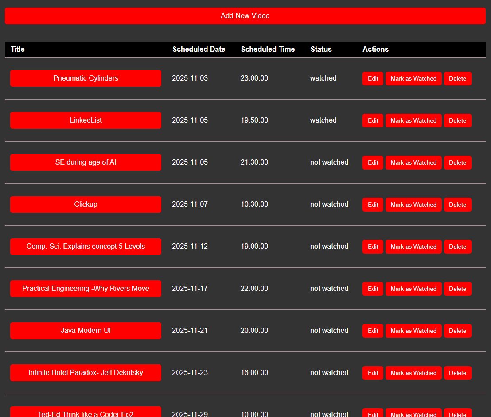

# VideoSched - YouTube Video Schedule Manager

## 🌟 The Problem
As a software engineering student in 2023, I found myself falling into a common trap: the YouTube rabbit hole. Opening video after video in multiple tabs, I'd lose track of time and struggle to manage my watching habits effectively. This project was born from a personal need to transform chaotic binge-watching into organized, scheduled viewing sessions.

## 💡 The Solution
VideoSched is a web application that helped me manage my YouTube watching habits by:
- Scheduling videos for specific dates and times
- Setting reminders for when to watch videos
- Tracking watched/unwatched status
- Visualizing the watching schedule in both calendar and list views

## ✨ Features
- **Video Management**: Add, edit, and delete YouTube videos from your schedule
- **Calendar View**: Visual representation of your watching schedule using FullCalendar
- **Time Management**: Set specific dates and times for watching videos
- **Reminder System**: Browser notifications when it's time to watch a scheduled video
- **Status Tracking**: Mark videos as watched to keep track of your progress
- **Responsive Design**: Mobile-friendly interface for on-the-go schedule management

## 🛠️ Built With
- **Frontend**: HTML, CSS, JavaScript
- **Backend**: PHP
- **Database**: MySQL
- **Libraries**:
  - FullCalendar 3.10.2 (calendar visualization)
  - jQuery 3.5.1
  - Moment.js 2.29.1
- **APIs**:
  - Browser Notifications API
  - YouTube (for video playback)

## 📝 Personal Learning Journey
This project was my one of my first real-world personal use applications as a software engineering student. It taught me:
- Full-stack web development
- Database design and management
- API integration
- User interface design
- Problem-solving through code
- The importance of solving personal pain points through programming

## 🚀 Installation & Setup
1. Clone the repository
2. Set up a PHP server (e.g., XAMPP, WAMP)
3. Create a MySQL database and import the schema
4. Update database credentials in `db.php`
5. Access through your local server

### Database schema
A sample SQL schema is provided in `db_schema.sql` at the repository root. It contains the original CREATE TABLE statement used when the project was deployed and the ALTER statement that added `reminder_time`.

Import using phpMyAdmin or the MySQL CLI. Example (MySQL CLI):
```sh
mysql -u your_db_user -p your_database_name < db_schema.sql
```

If you prefer to create the table manually, the main statements included are:
```sql
CREATE TABLE IF NOT EXISTS videos (
  id INT AUTO_INCREMENT PRIMARY KEY,
  title VARCHAR(255) NOT NULL,
  url VARCHAR(255) NOT NULL,
  scheduled_date DATE NOT NULL,
  scheduled_time TIME NOT NULL,
  status VARCHAR(50) DEFAULT 'not watched'
);

ALTER TABLE videos ADD COLUMN reminder_time TIME NULL;
```

## 💻 Usage
1. Open the application in your browser
2. Click "Add New Video" to schedule a video
3. Input the video details:
   - Title
   - YouTube URL
   - Scheduled date and time
   - Reminder time
4. View your schedule in calendar or list format
5. Receive notifications when it's time to watch a video
6. Mark videos as watched after viewing

## 📸 Screenshots
Below are placeholders — add real screenshots to `assets/` and commit them.

Calendar view:


List view:



Demo GIF (optional):


How to add screenshots:
1. Start your local server and open the app.
2. Capture the calendar and list views.
3. Save optimized images in `assets/` using the filenames above.
4. Commit and push; the README will display them automatically.

## 🤝 Contributing
While this was a personal project to solve my own YouTube watching habits, contributions are welcome! Feel free to:
1. Fork the repository
2. Create a feature branch
3. Commit your changes
4. Push to the branch
5. Open a Pull Request

## 📄 License
This project is open source and available under the [MIT License](LICENSE).

## 🎯 Future Improvements
- YouTube API integration for automatic video details fetching
- Multiple user support with authentication
- Playlist management
- Watch time analytics and reports
- Mobile app version

---
*Built with ❤️ by Maalik Hassan in 2023 as a solution to the YouTube rabbit hole problem.*